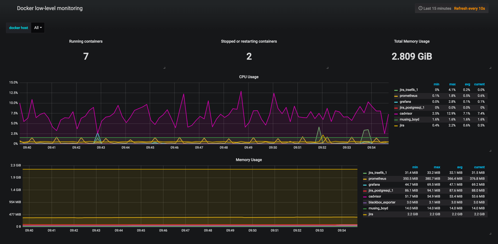

# cExporter - container stats prometheus exporter

> Like cAdvisor, but more lightweight


[](https://travis-ci.org/CheerlessCloud/cexporter)
[](https://goreportcard.com/report/github.com/cheerlesscloud/cexporter)

### Start in docker

```bash
docker run \
  -d \
  -v /var/run/docker.sock:/var/run/docker.sock \
  --log-opt max-size=10m \
  --name cexporter \
  -p 9167:9167 \
  cheerlesscloud/cexporter:1.0.1
```

### Grafana dashboard

Install from [grafana.com](https://grafana.com/dashboards/9168) or manually [from grafana-dashboard.json](./grafana-dashboard.json).


